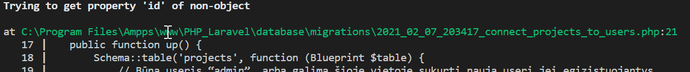
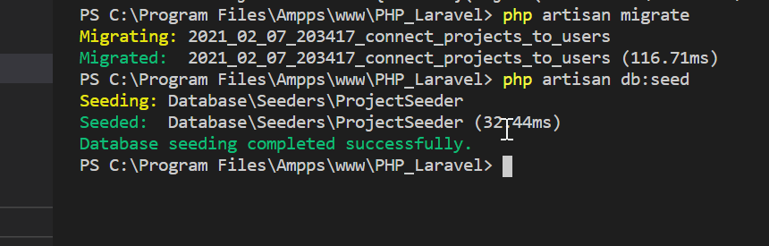

# PHP LARAVEL project

PHP Laravel CRUD application to manage projects, users and comments. Only authorized users can use CRUD operations. Screenshots below illustrates them.

## DB scheme


## How to install

```bash

# clone repository
https://github.com/lexaras/PHP_Laravel.git

# change directory
cd PHP_Laravel

# install all dependencies
composer update

npm install

npm run dev

# copy .env.example file
cp .env.expample .env

# add your database to .env

# generate app key
php artisan key:generate

# run migrations
php artisan migrate



As you noticed one migration failed. To pass it we need to register admin user by hand :
 - name = "admin"
 - email = "admin@any.com"
 - password = "anything(min 8 symbols)"

# run migration again
 php artisan migrate

# run seeders
 php artisan db:seed 



## Screenshots

* Login screen


---

* Customers table


---

* Customer filter


---

* Countries


---

* Country


--- 

* Add new city
