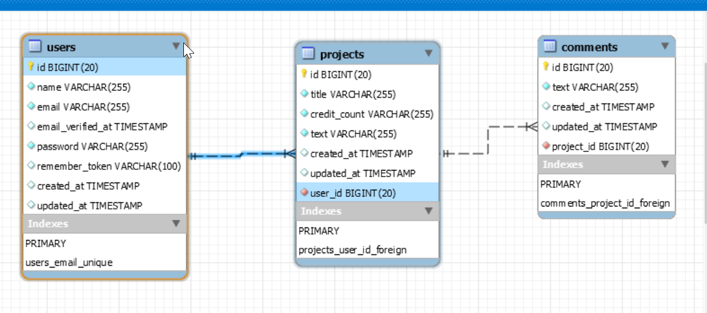

# PHP LARAVEL project

PHP Laravel CRUD application to manage projects, users and comments. Only authorized users can use CRUD operations. Screenshots below illustrates them.

## DB scheme




## How to install

```bash

# clone repository
https://github.com/lexaras/PHP_Laravel.git

# change directory
cd bit-final-project-demo

# install all dependencies
composer update

npm install

npm run dev

# copy .env.example file
cp .env.expample .env

# add your database to .env

# generate app key
php artisan key:generate

# run migrations and seeders
php artisan migrate:refresh --seed

# start application
php artisan serve

# email: admin@admin.com
# password: password
```

## Screenshots

* Login screen


---

* Customers table


---

* Customer filter


---

* Countries


---

* Country


--- 

* Add new city
